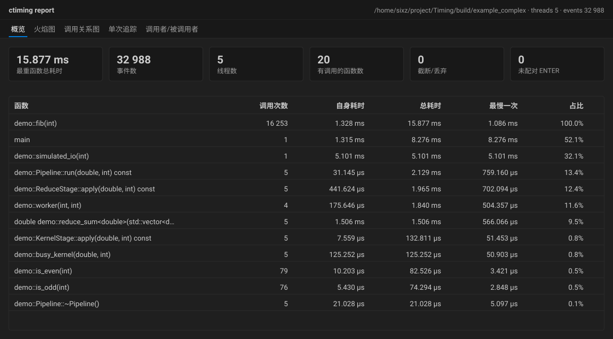
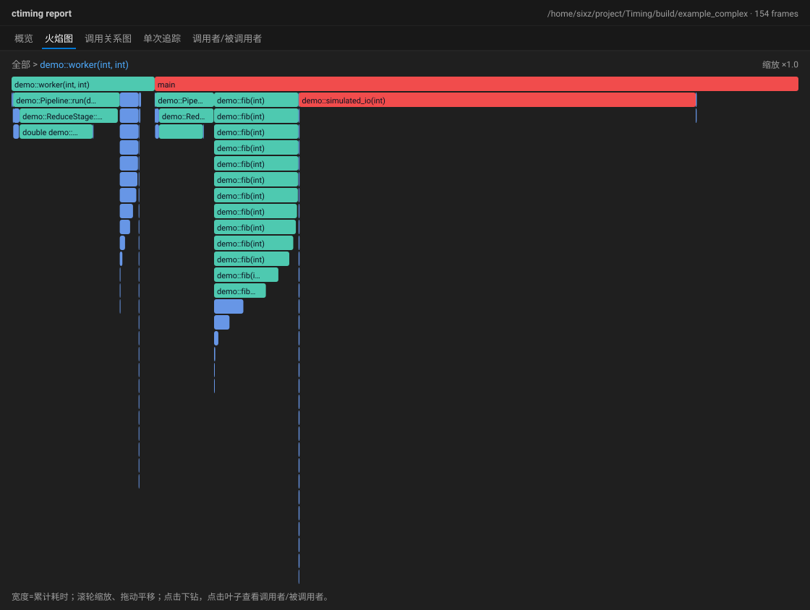
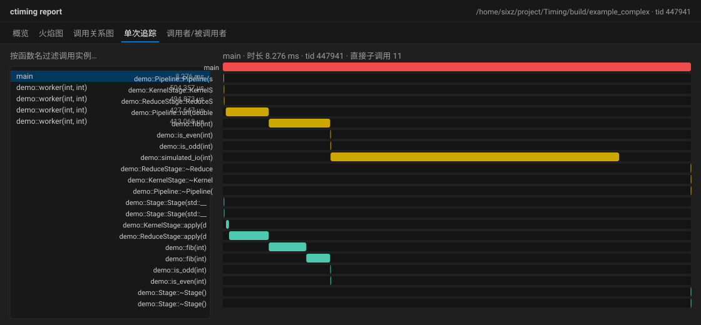

# ctiming

[](https://github.com/sixiaozhe/ctiming/actions/workflows/ci.yml)
[](LICENSE)

> Function-level timing & call tracing for C/C++ — flame graphs and self-contained offline HTML reports from a single `-finstrument-functions` build.

`ctiming` 是一个面向 C/C++ 程序的**函数级耗时统计与调用追踪工具**。它在编译期用 GCC/Clang 的 `-finstrument-functions` 给每个函数插入进入/退出钩子；运行时库 `libctiming` 把每次调用记录进每线程缓冲，进程退出时导出为二进制 `.ctrace`；再交给分析器 `ctiming-analyze` 重建调用树、聚合统计，输出文本摘要、全量 JSON，或生成自包含的离线 HTML 报告。

- **编译期插桩**：精确的函数级事件（进入/退出 + 纳秒时间戳）。
- **调用关系与单次追踪**：聚合火焰图、调用关系图、调用者/被调用者表，以及任选一次调用的瀑布时序。
- **运行期人工控制**：通过控制 FIFO 随时开关记录、改过滤、指定追踪目标、导出快照。
- **子树追踪**：只记录某个符号及其以下的调用栈。
- **自包含 HTML**：单文件、离线、无 CDN、无外部依赖。
- **零第三方依赖**：运行时仅 glibc；分析器仅 C++17 标准库。

## 界面预览

以下为 HTML 报告的实际渲染（由 `examples/example_complex` 生成；VSCode Dark Modern 主题；具体数值随运行变化）。

**概览** — KPI 与热点函数表（可排序，点击行查看上下游）



**火焰图** — 宽度=累计耗时，滚轮缩放、点击下钻、过渡动画



**单次追踪** — 选择任意调用实例，查看其子树瀑布时间线



## 快速开始

以下命令均在仓库根目录执行。

```bash
# 1) 构建运行时库与工具
cmake -S . -B build
cmake --build build -j

# 2) 用插桩标志编译你的程序，并链接 libctiming
gcc -finstrument-functions -g -O0 examples/example_single.c \
    -Iinclude -Lbuild -lctiming -o app

# 3) 运行程序：默认记录，退出时生成 ./app.ctrace
./app

# 4) 读回统计
./build/ctiming-info app.ctrace
```

`ctiming-info` 输出示例：

```
exe: /path/to/app
pid: 12345
modules: 3
symbols: 20
threads: 1
total_events: 18
dropped: 0
functions:
  6  leaf
  2  mid
  1  main
```

> 只有用 `-finstrument-functions` 编译的目标文件才会产生事件；运行时库本身无需该标志。输出路径默认是 `./<程序名>.ctrace`，可用 `CTIMING_OUT` 覆盖。

## 构建与测试

```bash
cmake -S . -B build && cmake --build build -j && ctest --test-dir build --output-on-failure
```

依赖：CMake ≥ 3.16、C11/C++17 编译器（GCC/Clang）、Linux glibc。产物：静态库 `ctiming`、`ctiming-info`、分析器 `ctiming-analyze`、示例程序与全部测试。

## 环境变量

| 变量 | 取值 | 默认 | 含义 |
|------|------|------|------|
| `CTIMING_ENABLE` | `off` / `0` 关闭，其它值或无 | 开启 | 是否记录 |
| `CTIMING_MAX_DEPTH` | 非负整数，`0` = 不限 | `0` | 最大调用深度，超过则不记录 |
| `CTIMING_INCLUDE` | 逗号分隔 glob | 未设（不限） | 非空时，函数名须命中才记录 |
| `CTIMING_EXCLUDE` | 逗号分隔 glob | 未设 | 命中的函数一律丢弃，优先级最高 |
| `CTIMING_EXCLUDE_LIB` | `off` / `0` 关闭，其它值或无 | 开启 | 默认排除 C/C++ 标准库符号（`std::`、`__gnu_cxx::` 等） |
| `CTIMING_OUT` | 文件路径 | `./<程序名>.ctrace` | 导出路径 |
| `CTIMING_BUF_KB` | 非负整数（KB） | `1024` | 每线程缓冲初始容量 |
| `CTIMING_BUF_MAX_KB` | 非负整数（KB），`0` = 不限 | `65536` | 每线程缓冲扩容上限，达到后标记截断并停止该线程记录 |
| `CTIMING_DROP_UNKNOWN` | `1` 丢弃；其它值或未设置 = 保留 | `0`（保留） | 是否丢弃无法符号化的地址 |
| `CTIMING_CTL` | 文件路径 | 未设 | 控制 FIFO 路径，设置后接受运行期命令 |
| `CTIMING_TRACE` | 逗号分隔 glob | 未设 | 启动期设置子树追踪根，只记录命中函数的动态范围内（含自身）的调用 |

过滤语义：默认先排除 C/C++ 标准库符号（`CTIMING_EXCLUDE_LIB=off` 可关闭）；随后 **`EXCLUDE` 优先**——命中 `EXCLUDE` 即丢弃；否则若 `INCLUDE` 非空则必须命中才保留，`INCLUDE` 为空则保留。判定基于函数自身的限定名，参数/返回值里含 `std::` 的用户函数仍会保留；无法符号化的地址（`0x...`）默认保留。详见 [docs/usage.md](docs/usage.md)。

## 运行期控制与子树追踪

给 `CTIMING_CTL` 指定一个 FIFO 路径后，可随时人工开关记录、改过滤、指定追踪目标并导出：

```bash
CTIMING_CTL=/tmp/app.fifo CTIMING_OUT=/tmp/app.ctrace ./app &
echo 'trace myapp::hot'      > /tmp/app.fifo   # 只追踪该符号及其以下调用栈
echo 'stop'                  > /tmp/app.fifo   # 暂停
echo 'start'                 > /tmp/app.fifo   # 恢复
echo 'include myapp::*'      > /tmp/app.fifo   # 改名称过滤
echo 'dump /tmp/snap.ctrace' > /tmp/app.fifo   # 导出快照
echo 'status'                > /tmp/app.fifo
```

命令：`start` / `stop` / `toggle` / `dump [PATH]` / `trace [SPEC]`（`trace off` 清除）/ `untrace` / `include [GLOB]` / `exclude [GLOB]` / `status`；回复打印到 stderr。设置追踪根后只记录该函数动态范围内（含自身）的调用。详见 [docs/usage.md](docs/usage.md)。公共 API 见 [include/ctiming.h](include/ctiming.h)。

## 分析器

```bash
./build/example_single                                  # 生成 example_single.ctrace
./build/ctiming-analyze example_single.ctrace           # 文本摘要
./build/ctiming-analyze example_single.ctrace --json analysis.json
```

`--include GLOB`、`--exclude GLOB`、`--min-total NS`、`--top N` 决定文本摘要显示哪些函数，并写入 JSON 每个函数的 `kept` 标记；`--json` 始终写出全量自洽数据。退出码：`0` 成功，`1` 读取/写文件失败，`2` 用法错误。字段与语义见 [docs/analyzer.md](docs/analyzer.md)。

## HTML 报告

```bash
./build/example_single
./build/ctiming-analyze example_single.ctrace -o report.html
```

生成**自包含、离线可用**的单文件报告（`-o` 与 `--html` 等价，可与 `--json` 同时使用）。报告含概览、火焰图、调用关系图、单次追踪、调用者/被调用者五个视图，以及全局函数搜索与时间轴缩放。详见 [docs/viewer.md](docs/viewer.md)。

## 项目结构

```
include/ctiming.h        公共 API
src/                     运行时库（C）：钩子、缓冲、自符号化、配置、.ctrace 读写、控制 FIFO
src/analyze/             分析器（C++17）：配对、聚合、调用图、JSON、HTML 生成
tools/                   命令行工具：ctiming-info、ctiming-analyze
viewer/                  HTML 查看器资源（CSS/JS，编译期内嵌）
examples/                示例程序
tests/                   单元测试与端到端集成测试
cmake/                   资源内嵌脚本
```

## 文档

- [docs/usage.md](docs/usage.md) — 运行时库、环境变量、公共 API、运行期控制、`.ctrace` 格式
- [docs/analyzer.md](docs/analyzer.md) — `ctiming-analyze` 用法与 `analysis.json` 字段
- [docs/viewer.md](docs/viewer.md) — HTML 查看器使用说明

## 已知局限

- **被内联的函数不会出现**：`-finstrument-functions` 按函数体插桩，内联后原函数消失。
- **建议使用 `-O0` 或 `-Og`**：高优化等级（`-O2`/`-O3`）下大量函数被内联，结果会明显失真。
- **仅支持 64 位 ELF / Linux**：自符号化依赖 `/proc/self/maps` 与 ELF `.symtab`/`.dynsym`。
- 头部/尾部极早构造期的调用可能被丢弃；未插桩目标不会有任何事件。
- `dump` 只导出已退出线程缓冲 + 调用 `dump` 的线程自身缓冲；FIFO 文件不自动删除。

## 贡献

欢迎提交 Issue 与 Pull Request，详见 [CONTRIBUTING.md](CONTRIBUTING.md)。

## 许可证

本项目采用 [MIT 许可证](LICENSE)。
